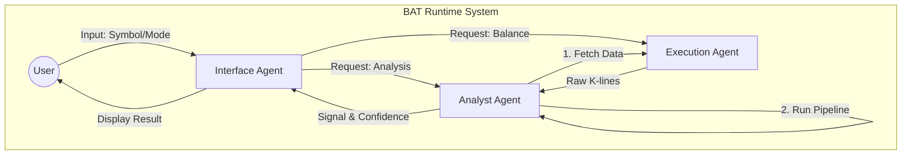

# 🤖 BAT System & Development Agents Architecture

本文件定義 **Binance Auto Trader (BAT)** 的雙重智能體架構：
1. **Runtime Agents**：實際在程式碼中運作的模組化角色。
2. **Dev Team Agents**：輔助開發者進行迭代的虛擬 AI 團隊。

---

## 🌐 Part 1: Runtime Agents

BAT 採用 Multi-Agent 協作架構，將「感知」、「決策」、「執行」與「記憶」拆分，方便針對單一模組升級或替換。

### 1. Interface Agent（介面智能體）
- **Source Code**: `src/bat/tui/app.py`
- **Role**: 人機互動介面 (HCI)
- **Responsibilities**
  - 接收人類指令（選擇模式、查詢餘額）。
  - 視覺化狀態（日誌、餘額、提示訊息）。
  - **非同步調度**：將指令分派給 Analyst / Broker。

### 2. Analyst Agent（分析師智能體）
- **Source Code**: `src/bat/analyzer.py`
- **Role**: 市場感知與決策
- **Responsibilities**
  - **Data Ingestion**：拉取 K 線資料。
  - **Feature Engineering**：RSI / SMA / Momentum 等特徵。
  - **Inference Pipeline**
    - RSI：超買超賣判斷
    - ML：Random Forest 趨勢分類
    - Deep：LSTM 價格預測
  - **Fallback Handling**：單一模型失敗時不中斷流程。

### 3. Execution Agent（執行智能體 / Broker）
- **Source Code**: `src/bat/execution/broker.py`
- **Role**: 交易執行與資產管理
- **Responsibilities**
  - 維護 Binance API 連線（使用 `binance-sdk-spot` + `binance-sdk-wallet`，支援 Testnet/Real）。
  - 簽名與權限驗證。
  - 買賣下單與餘額回報。
  - 透過 `src/bat/execution/spot_client.py` 統一 Spot Client 與 async 介面。

### 4. Logger Agent（紀錄智能體）
- **Source Code**: `src/bat/logger.py`
- **Role**: 系統記憶與除錯
- **Responsibilities**
  - 將事件輸出至檔案與 UI。
  - 捕捉 Traceback 與錯誤訊息。

#### 🔄 Runtime Interaction Flow



---

## 👨‍💻 Part 2: AI Development Team

輔助開發 BAT 的虛擬 AI 角色分工，可作為 Prompting 參考。

## 📌 訊號與決策判斷依據

- **訊號來源**：三分類模型輸出機率，採用 `argmax` 作為訊號
  - 類別 2 → BUY
  - 類別 1 → HOLD
  - 類別 0 → SELL
- **信心值**：使用 `max(softmax)` 作為信心百分比。
- **決策閾值**：若信心值低於使用者設定門檻，決策會被強制改為觀望（source=filtered）。

## 📏 Versioning Protocol (版本控制協議)

為了確保 CI/CD 與 Release 的穩定性，所有 Agents 必須遵守以下規則：

### 1. **Semantic Versioning (語意化版本)**
格式：`v<MAJOR>.<MINOR>.<PATCH>` (e.g., `v1.0.0`)
- **MAJOR**: 重大架構變更或不兼容更新 (Breaking Changes)
- **MINOR**: 新功能向下相容 (New Features)
- **PATCH**: Bug 修復 (Bug Fixes)

### 2. **Single Source of Truth (單一真理來源)**
**Git Tag** 是版本的觸發點，但程式碼必須同步。
- **Trigger**: Release Workflow 由 `git push tag v*` 觸發。
- **Rule**: 當 Tag `v1.0.0` 被推送時，以下檔案 **必須** 包含 `1.0.0`：
  1. `pyproject.toml` (`version = "1.0.0"`)
  2. `src/bat/config.py` (`VERSION = '1.0.0'`)

### 3. **Changelog Policy**
每次版本更新（Tagging）前，必須更新 `CHANGELOG.md`：
- 將 `[Unreleased]` 變更移動到新的版本號標題下。
- 遵循 "Keep a Changelog" 格式。

### 4. **Branching Strategy**
- **clean-repo**: 穩定的生產分支 (Production)。**只接受 PR 合併，禁止直接 Push。**
- **feat/** 或 **fix/**: 開發分支。完成後發 PR 到 `clean-repo`。**所有工作請務必要開PR**
- **實驗性分支**: 命名為 `exp/<feature>`，可不遵守上述嚴格版本規則，但在合併回 `clean-repo` 前必須標準化。**可以使用nightly branch發版本更新**

### 1. Product Manager (PM)
- **目標**: 需求轉規格
- **任務**
  - 拆解模糊需求（例：「更聰明」→「引入強化學習」）
  - 優先級排序與進度追蹤
- **Output**: `SPEC.md`, TODO List

### 2. Software Architect (架構師)
- **目標**: 系統模組化與可擴充性
- **任務**
  - 模組介面設計
  - 技術選型（pandas vs polars, LSTM vs Transformer）
  - 維護目錄結構整潔
- **Output**: `DESIGN.md`, File Structure

### 3. Code Engineer (工程師)
- **目標**: 高品質可執行程式碼
- **任務**
  - 功能實作
  - 重構與最佳化
  - Docstring 與必要註解
- **Output**: `.py` Source Code

### 4. QA & Security Engineer (測試與資安)
- **目標**: Bug、風險與安全性檢查
- **任務**
  - API Key 洩漏檢查
  - 交易邏輯風險檢查
  - Lint / 單元測試 / 回測
- **Output**: `BUG_REPORT.md`, Security Audit

---

## 🛠️ Dev Workflow Example: Adding MACD

```
User -> PM: "幫我把 MACD 指標加入到分析流程裡。"
PM -> Architect: "請規劃 analyzer.py 的修改範圍。"
Architect -> Engineer: "新增 MACDStrategy，使用 pandas_ta.macd()。"
Engineer -> QA: "代碼完成，請驗證。"
QA -> Engineer: "測試失敗，NaN 未處理且需檢查 Key。"
Engineer -> QA: "已修正。"
PM -> User: "任務完成。"
```

---

## 🚀 Part 3: Starforge Integration（未來整合）

- **Kernel Monitor Agent**：監控記憶體與 CPU，防止 OOM。
- **Network Sentinel**：僅允許白名單 API 網段。
- **Cron Scheduler**：背景排程定期訓練與評估。

## 🐛 Bug Fixes & Code Audits

| Scope | Description | Status |
|---|---|---|
| `timedate` | Fix `integrity.py` using local time for API calls (force UTC). | ✅ Fixed |
| `data` | Fix `NoneType` error in `merge_healed_data` on full redownload. | ✅ Fixed |
| `data` | Fix `pd.to_datetime` mixed timezone warnings. | ✅ Fixed |
| `tui` | Fix Stop button ignoring data download/check tasks. | ✅ Fixed |
| `data` | Fix Crash: `MinMaxScaler` fitting on empty data (0 samples). | ✅ Fixed |
| `sim` | Fix Crash: `NoneType` attribute error when analysis fails. | ✅ Fixed |
| `broker` | Fix Resource Leak: Client session not closed in `close()`. | ✅ Fixed |
| `broker` | Fix Race Condition: Concurrent `init_client` calls. | ✅ Fixed |
| `training` | Fix Error Handling: Wrap `on_epoch_loss` callback. | ✅ Fixed |
| `dataset` | Fix `pd.to_datetime` explicit UTC in `1h` resampling. | ✅ Fixed |
